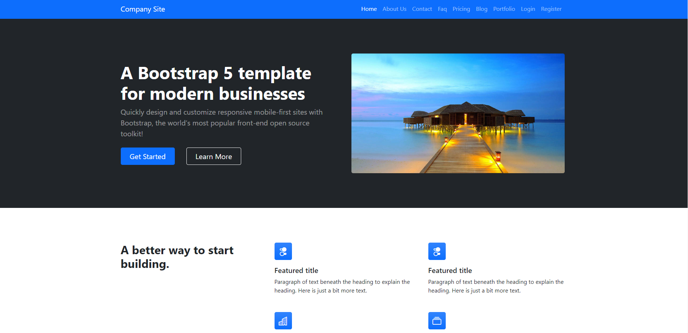
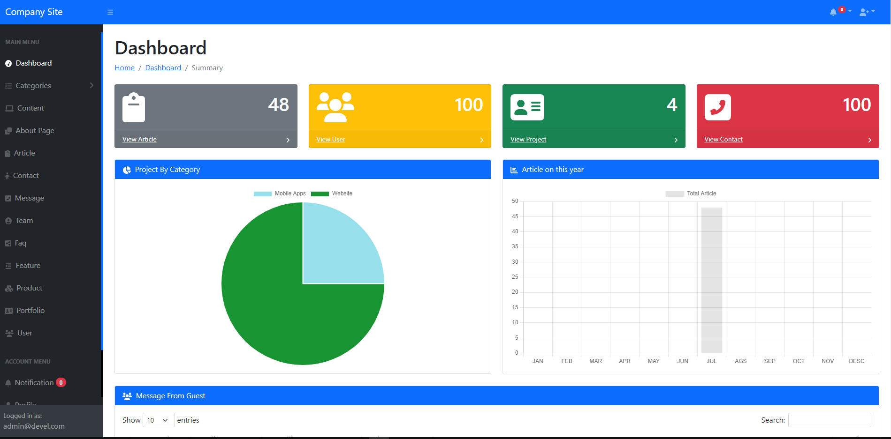
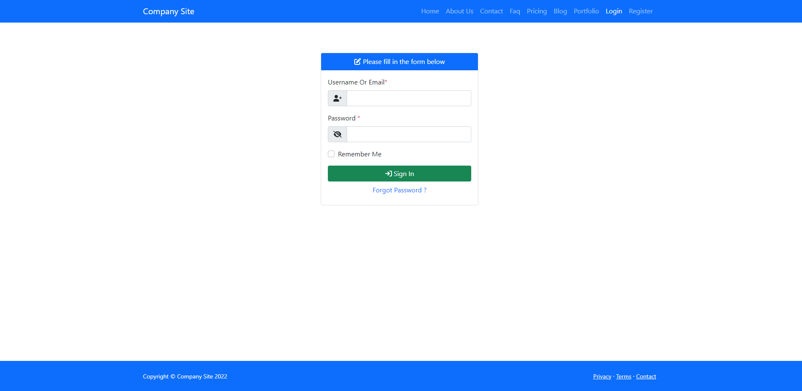
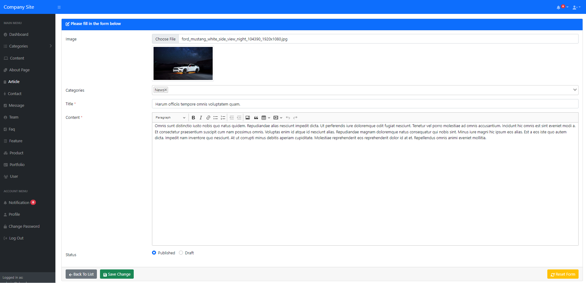
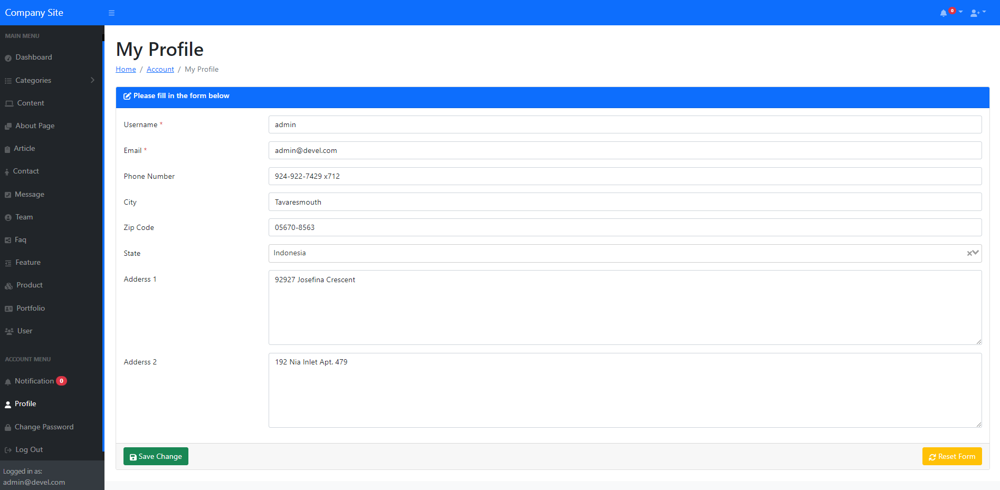

# Screenshot

    
     
    
     
    
     
    
     
    
     

# Introduction

Company profie website will generally include : 

<ul>
    <li>Be able to answer customers’ inquiries about your business.</li>
    <li>Briefly describe the operations and focus of your business.</li>
    <li>Include are product descriptions, pricing plans, and testimonials.</li>
    <li>Provide contact details or some way for customers to contact your business online directly.</li>
    <li>Offer insights into anything your customers might want to know.</li>
    <li>Include testimonials from former clients and employers to show your skills and expertise</li>
    <li>Offer links to your social media accounts so future clients and recruiters can get a fuller idea of your personality and get in touch with you easier</li>
    <li>Feature a home page, a contact page, and a product or service page</li>
    <li>User compelling content that encourages users to buy into the product or service </li>
</ul>

 

# Minimum Requirements
<ul>
    <li>.NET Core 3.1 SDK and Runtime</li>
    <li>Node JS 14+ </li>
    <li>PostgreSQL 9+</li>
    <li>Git</li>
    <li>Modern Web Browser.</li>
    <li>Visual Studio Code or Visual Studio for editor.</li>
</ul>
 

# How To Install
 
 
<strong>Clone this repository using command <em>git clone https://github.com/sanz404/webapp-company-profile-net-core.git</em></strong>
 

 
 
<strong>Backend</strong>
<ul>
    <li>Make sure <em><strong>.NET Core 3.1 SDK & Runtime, and PostgreSQL 9+</strong></em> installed in your computer.</li>
    <li>Move to backend directory and open command line then run script <em><strong>dotnet restore</strong></em>.</li>
    <li>In appsettings.json file, please change database connection configuation.</li>
    <li>Please run script to installing backend service.
        <ul>
            <li><em><strong>dotnet build</strong></em></li>
            <li><em><strong>dotnet ef database update</strong></em></li>
        </ul>
    </li>
    <li>To starting backend service, please run <em><strong>dotnet run</strong></em></li>
</ul>

 

<strong>Frontend</strong>
<ul>
    <li>Move to frontend directory and open command line.</li>
    <li>Please run <em><strong>npm install</strong> and then <strong>npm run serve</strong> to starting frontend application</em>.</li>
    <li>Open your web browser with address <em><strong>localhost:8080</strong></em>.</li>
    <li>Login with user admin : <em><strong>Email : admin@devel.com, Password : 5ecReT!</strong></em></li>
</ul>